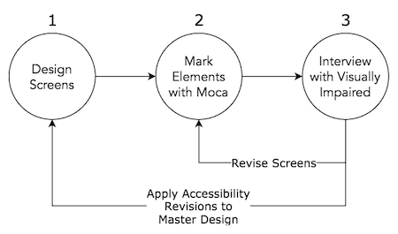

# Moca

Moca is a mockup tool for designing accessibility experience for disabled people.

You can import your screen images and mark UI elements visible at the screen.

Then you can test your UI with visually impaired people.

[Go to Moca Demo](https://imesut.github.io/Moca/app/?demo=1)

[Go to Moca App](https://imesut.github.io/Moca/app/)

# Purpose

Moca, is my weekend project, that I need to use as a product manager while working with a visually impaired community.

Designing applications or any design properly accessible requires feedback from visually impaired while working and deciding on features. Moca is a tool for interviewing design ideas with visually impaired. User interview preparation process is shown in the image below.



# How it's working?

// TODO

# How to Install?

Just clone this repository to your computer and open the ```index.html``` file from app folder!

# Contribute

I will be delighted to see contributions (pull requests) to Moca. Primarily looked for the contribution topics below; 

- Complete PWA compatibility
- New features
- UX Improvements for Screen Designer
- Multiple Screen Creation in a Single file
- Save the Progress Feature (importing and exporting moca file)